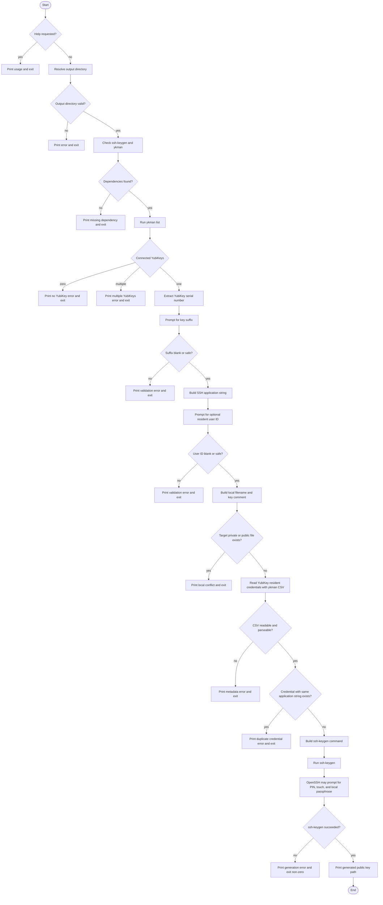

# Generate Script Flow

This document explains what `generate_fido2_ssh_key_using_yubikey.sh` does without requiring you to read the script directly. The script creates one resident `ed25519-sk` SSH key on one connected YubiKey, then saves the local private/public key stub files in the chosen output directory.

## Main Flow

## Data Created

The script creates or uses these values:

- Application string: `ssh:yk_<serial>` plus an optional suffix, for example `ssh:yk_<serial>_github_sign`.
- Local private key file: `id_ed25519_sk_rk_yk_<serial>` plus optional suffix and resident user ID.
- Local public key file: the same filename with `.pub` added.
- Resident user ID: optional metadata stored in the YubiKey credential with OpenSSH's `-O user=...` option.
- Public key comment: the resident user ID when provided; otherwise the entered comment/default local identity.

## Validation Rules

The output directory must already exist, be owned by the current user, be writable, and not be writable by group or others.

The suffix and resident user ID may contain only letters, numbers, `.`, `_`, `@`, `+`, and `-`, with a maximum length of 31 characters. Leading and trailing whitespace is trimmed, and embedded whitespace is rejected.

## Prompt Sources

The script prints guidance before commands that may prompt you. The actual prompts come from:

- `ykman`, while checking existing credentials on the YubiKey.
- `ssh-keygen`, while creating the resident SSH key, requesting the FIDO2 PIN, waiting for touch confirmation, and optionally setting a local key-stub passphrase.

## Conflict Checks

Before generating anything, the script checks two separate conflict types:

- Local file conflicts: whether the intended private key or `.pub` file already exists.
- YubiKey credential conflicts: whether the YubiKey already has a resident credential with the same SSH application string.

If either conflict exists, the script exits instead of overwriting or replacing data.
