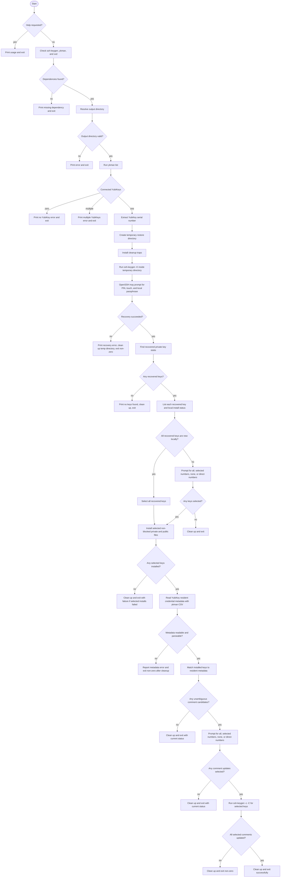
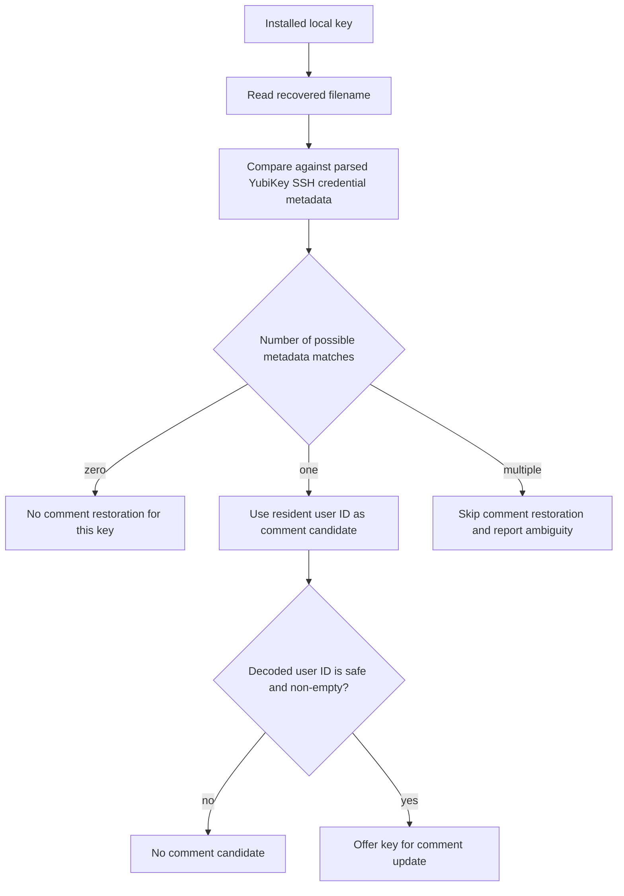

# Restore Script Flow

This document explains what `restore_fido2_ssh_keys_from_yubikey.sh` does without requiring you to read the script directly. The script recovers resident SSH key stubs from one connected YubiKey, installs selected files into an output directory, and can update local key comments from resident user ID metadata.

## Main Flow

## Install Selection

The restore script first downloads all recoverable resident SSH key stubs into a temporary directory. It then lets you choose which recovered files should be installed into the output directory.

Each recovered key is classified as:

- `new`: no matching local private or public file exists.
- `exists`: a matching local private or public file already exists.
- `blocked`: the matching local file is a symlink or another non-regular file, so the script refuses to overwrite it.

If every recovered key is new, all keys are selected automatically. If any local conflict exists, the script asks whether to install all, selected keys, none, or a direct numeric list.

## Metadata Matching

The script does not guess when metadata is ambiguous. Ambiguity can happen if different resident credentials can produce the same recovered filename shape after combining suffix and resident user ID.

## Comment Restoration

OpenSSH recovery writes public key comments based on the resident credential application string. If a key was originally created with a resident user ID, this script can decode that user ID from the YubiKey metadata and apply it as the local SSH key comment.

Comment updates are optional. You can update all offered keys, selected key numbers, no keys, or enter numbers directly at the prompt.

## Temporary Directory Cleanup

Recovered files are first written to a temporary directory created with restrictive permissions. The script removes that directory on normal exit and common interrupt signals.

The temporary directory cannot be cleaned automatically after `SIGKILL`, power loss, or a hard crash. In that case, remove leftover `yk-ssh-restore.*` directories from your system temporary directory after confirming they are not from a running restore.

## Exit Status

The script exits non-zero for validation errors, dependency failures, unsafe output paths, failed recovery, selected install failures, metadata parse errors, ambiguous metadata that blocks requested comment restoration, and selected comment-update failures.

User-chosen no-op paths, such as selecting no keys to install or declining comment updates, exit successfully.
